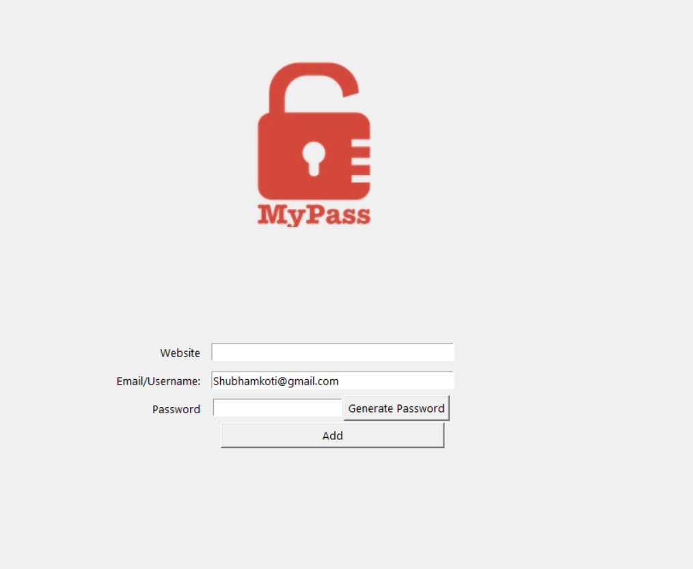

# Password Manager

A simple Password Manager built using Python and Tkinter.

## Features

- Generate strong random passwords
- Copy passwords to clipboard
- Save website, email, and password details
- User-friendly GUI

## Technologies Used

- Python
- Tkinter
- Pyperclip

## Screenshot



## How to Run

```bash
pip install pyperclip
python main.py
```